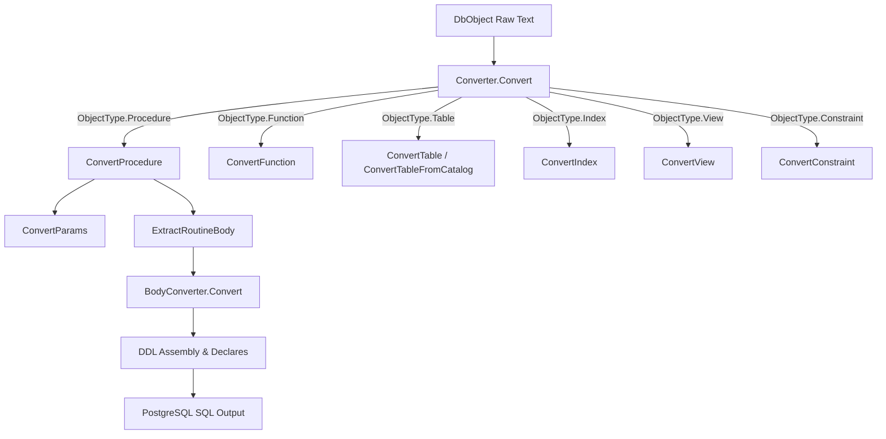
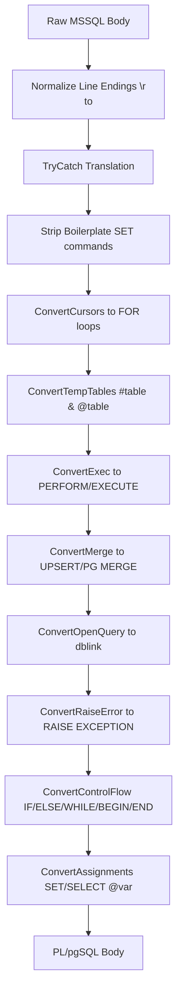
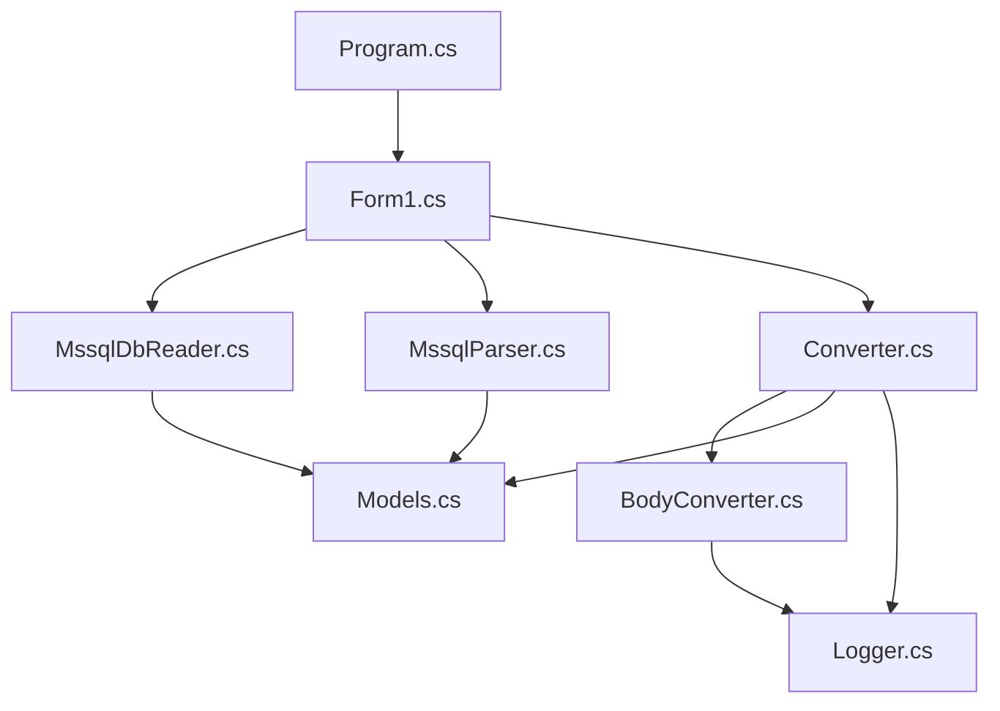
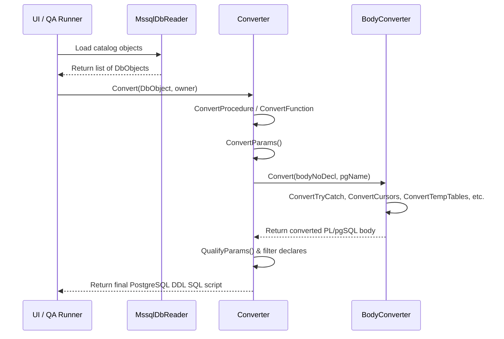

# Converter Architecture Report

This report documents the architectural design, processing pipelines, and module responsibilities of the SQL Server-to-PostgreSQL schema converter.

---

## 1. Converter Pipeline

The conversion engine coordinates processing using a pipeline that dispatches object types to specialized transformers:



---

## 2. Parser Flow

[MssqlParser.cs](file:///e:/pg_converter_ui/MssqlParser.cs) parses source script files prior to conversion:
1.  **Block Splitting:** The script text is split using a multi-line `GO` boundary regex: `(?m)^\s*GO\s*$`.
2.  **Object Classification:** Each text block is evaluated against a sequence of regex patterns to determine its object type and name:
    *   *Procedure:* `(?:CREATE\s+OR\s+ALTER|ALTER|CREATE)\s+(?:PROCEDURE|PROC)\s+(?:\[?dbo\]?\.)?\[?(\w+)\]?`
    *   *Function:* `(?:CREATE\s+OR\s+ALTER|ALTER|CREATE)\s+FUNCTION\s+(?:\[?dbo\]?\.)?\[?(\w+)\]?`
    *   *View:* `(?:CREATE\s+OR\s+ALTER|ALTER|CREATE)\s+VIEW\s+(?:\[?dbo\]?\.)?\[?(\w+)\]?`
    *   *Table:* `CREATE\s+TABLE\s+(?:\[?dbo\]?\.)?\[?(\w+)\]?`
    *   *Constraint:* `ALTER\s+TABLE\s+(?:\[?dbo\]?\.)?\[?(\w+)\]?\s+(?:WITH\s+CHECK\s+)?ADD\s+CONSTRAINT\s+\[?(\w+)\]?`
    *   *Index:* `CREATE\s+(?:UNIQUE\s+)?(?:CLUSTERED\s+|NONCLUSTERED\s+)?INDEX\s+\[?(\w+)\]?`
3.  **Complexity Check:** Routines are evaluated with `BodyConverter.IsTrueStub` to detect CLR procedures (`EXTERNAL NAME`) which are flagged as unhandleable.

---

## 3. BodyConverter Flow

[BodyConverter.cs](file:///e:/pg_converter_ui/BodyConverter.cs) processes complex SQL bodies via a sequential pipeline:



---

## 4. Expression Converter

Expression transformations target type conversions, string manipulation, and operators:
*   **String Concatenation:** String expressions using `+` are mapped to `||`. Example: `expr1 + expr2` becomes `expr1 || expr2`.
*   **Type Casting:** `CONVERT(type, expr, style)` is translated to `CAST` or PostgreSQL notation:
    *   `CONVERT(CHAR(16), date, 120)` $\rightarrow$ `TO_CHAR(date, 'YYYY-MM-DD HH24:MI')`
    *   `CONVERT(nvarchar(N), expr)` $\rightarrow$ `expr::text`
    *   `CONVERT(BIGINT, 0)` $\rightarrow$ `0::bigint`
*   **Boolean Value Mapping:** MSSQL numeric bit assignments (`0`/`1`) are translated to PostgreSQL booleans (`false`/`true`).

---

## 5. Parameter Converter

Parameters are parsed inside `ConvertParams`:
1.  **Comment Stripping:** Single-line comments `--` are stripped from the parameter block before parsing.
2.  **Splitting:** The string is split by commas while respecting parenthesized sub-clauses (e.g. data type sizes).
3.  **Signature Construction:** For each parameter:
    *   The prefix `@` is stripped.
    *   MSSQL types are mapped to PostgreSQL types via `MapType`.
    *   `OUTPUT` qualifiers are translated to `INOUT`.
    *   Default values are evaluated via `MapDefault`.
    *   Parameters are declared in the function header, sorted with non-default parameters appearing first.

---

## 6. Validation Pipeline

The validation framework guarantees correctness across three layers:
1.  **Unit Tests (Fast Feedback):** NUnit test files ([RegressionTests.cs](file:///e:/pg_converter_ui/tests/Regression/RegressionTests.cs) and [UnsupportedFeaturesTests.cs](file:///e:/pg_converter_ui/tests/Regression/UnsupportedFeaturesTests.cs)) verify small, isolated conversion scenarios.
2.  **Integration QA Tests:** [BoardRegressionTests](file:///e:/pg_converter_ui/qa/BoardRegressionTests/Program.cs) compiles and evaluates representative Board module procedures, throwing exceptions on output discrepancies.
3.  **Target Verification:** Generates schema and procedure script files, and executes them against a target PostgreSQL 9.3 database using `psql`, capturing stderr validation output.

---

## 7. Function Responsibility Matrix

*   **[Converter.cs](file:///e:/pg_converter_ui/Converter.cs):**
    *   Handles DDL header syntax generation (`CREATE OR REPLACE FUNCTION`).
    *   Extracts routine blocks and maps parameter list signatures.
    *   Determines data types and scalar function return structures.
*   **[BodyConverter.cs](file:///e:/pg_converter_ui/BodyConverter.cs):**
    *   Performs core syntax rewriting on procedural bodies.
    *   Converts control flow structures (blocks, loops, condition branches).
    *   Replaces temp table and table variables.
*   **[MssqlDbReader.cs](file:///e:/pg_converter_ui/MssqlDbReader.cs):**
    *   Executes database connections to MS SQL.
    *   Reads and parses database catalogs (tables, constraints, routines).
*   **[MssqlParser.cs](file:///e:/pg_converter_ui/MssqlParser.cs):**
    *   Splits files into procedural elements using `GO` delimiters.
*   **[Models.cs](file:///e:/pg_converter_ui/Models.cs):**
    *   Defines metadata models (`DbObject`, `ColumnInfo`, `ObjectType`).
*   **[Logger.cs](file:///e:/pg_converter_ui/Logger.cs):**
    *   Writes operation logging records.

---

## 8. File Dependency Graph

The project source files reference each other according to the following dependency layout:



---

## 9. Call Graph

Execution starts at the UI event handler or QA runner, flowing down through parsing and transformation:



---

## 10. Typical Conversion Flow

The following example details how a simple MS SQL procedure passes through the pipeline:

### 1. Input MS SQL Source
```sql
CREATE PROCEDURE dbo.usp_GetUsers
    @TenantId INT,
    @IsActive BIT = 1
AS
BEGIN
    SELECT Name FROM dbo.Users WHERE TenantId = @TenantId AND IsActive = @IsActive;
END
```

### 2. Header & Parameter Extraction
*   Name: `usp_getusers` (lowercased)
*   Parameters: `IN tenantid integer, IN isactive boolean DEFAULT true`
*   Isolated raw body text:
    ```sql
    SELECT Name FROM dbo.Users WHERE TenantId = @TenantId AND IsActive = @IsActive;
    ```

### 3. BodyConverter Processing
1.  **Line Endings Normalization:** Normalize line formatting to `\n`.
2.  **Boilerplate Stripping:** No SET instructions present.
3.  **Schema Replacement:** `dbo.Users` replaces to `public.Users`.
4.  **Token Conversion:** `@` references stripped: `@TenantId` $\rightarrow$ `tenantid`, `@IsActive` $\rightarrow$ `isactive`.
5.  **Result Injection:** `SELECT Name FROM public.Users WHERE TenantId = tenantid AND IsActive = isactive;` detected as a result-returning SELECT. Replaces to `RETURN QUERY SELECT Name FROM public.Users WHERE TenantId = usp_getusers.tenantid AND IsActive = isactive;`.

### 4. Output PL/pgSQL Script
```sql
-- ─── PROCEDURE→FUNCTION: usp_getusers ───────────────────────────────
-- NOTE: SQL Server stored procedure converted to PostgreSQL function.
-- TODO: Review converted output — stored procedure semantics differ; test before use in production.
-- TODO: replace SETOF record — procedure returns results; add RETURNS TABLE(col type, ...) manually
-- TODO: procedure contains result-returning SELECT; replace SETOF record with correct column types
DROP FUNCTION IF EXISTS public.usp_getusers(integer, boolean);
CREATE OR REPLACE FUNCTION public.usp_getusers(
    IN tenantid integer,
    IN isactive boolean DEFAULT TRUE
) RETURNS SETOF record
AS $function$
BEGIN
    RETURN QUERY SELECT Name FROM public.Users WHERE TenantId = usp_getusers.tenantid AND IsActive = isactive;
END;
$function$
LANGUAGE plpgsql;
-- TODO: Owner mapping skipped. Target role dazone not verified.
```
