# Master Migration Roadmap

This document outlines the ranked implementation plan, impact metrics, dependencies, and target milestones for updating the database converter, based primarily on [HighImpactFixes.md](file:///e:/pg_converter_ui/reports/HighImpactFixes.md) and [RemainingSchema_QA.md](file:///e:/pg_converter_ui/reports/RemainingSchema_QA.md).

---

## 1. Ranked Implementation Order

### Rank 1: Carriage Return `\r` Semicolon Shielding Normalization
* **Estimated PASS Increase:** **+300 objects**
* **Actual PASS Increase:** **+7 procedures (Board%)** (compiler pass rate increased from 82% to 86%)
* **Risk Level:** Low
* **Regression Risk:** Low
* **Dependencies:** None
* **Converter File:** [Converter.cs](file:///e:/pg_converter_ui/Converter.cs)
* **Function:** `Convert` or start of `ConvertBody`
* **Description:** Normalize carriage returns (`\r\n` and `\r`) to `\n` at the entry point of the body converter. This stops `\r` from shielding lookbehinds and prevents invalid double semicolons `;;`.
* **Status:** **Completed**
* **Actual ROI:** Extremely High (resolved 7 syntax failures with a 2-line whitespace normalization fix).

### Rank 2: Duplicate Parameter/Variable Declaration Filter
* **Estimated PASS Increase:** **+343 objects**
* **Risk Level:** Low
* **Regression Risk:** Low
* **Dependencies:** None
* **Converter File:** [Converter.cs](file:///e:/pg_converter_ui/Converter.cs)
* **Function:** `ConvertProcedure` / `ConvertFunction`
* **Description:** Filter out procedure parameters from the extracted local variables declaration block. Redeclaring variables with names matching parameters in the same scope triggers compiler failures.

### Rank 3: Comment Shielding Block Keyword Formatting (`THEN` / `LOOP`)
* **Estimated PASS Increase:** **+224 objects**
* **Risk Level:** Medium
* **Regression Risk:** Low
* **Dependencies:** None
* **Converter File:** [BodyConverter.cs](file:///e:/pg_converter_ui/BodyConverter.cs)
* **Function:** `ConvertBody`
* **Description:** Move keywords like `THEN` or `LOOP` before single-line comments `--` or push trailing comments to their own line above, preventing PostgreSQL from ignoring required block headers.

### Rank 4: Date Default Parsing (`GETDATE` -> `CURRENT_DATE`)
* **Estimated PASS Increase:** **+157 objects**
* **Risk Level:** Low
* **Regression Risk:** Low
* **Dependencies:** None
* **Converter File:** [Converter.cs](file:///e:/pg_converter_ui/Converter.cs#L929)
* **Function:** `MapDefault`
* **Description:** Check for date function calls (like `GETDATE` or `GETDATE()`) before wrapping words in single quotes, mapping them to `CURRENT_DATE` or `now()`.

### Rank 5: Double-Quoting Reserved Keywords (desc, To, Left, Right, User)
* **Estimated PASS Increase:** **+200 objects**
* **Risk Level:** Low
* **Regression Risk:** Low
* **Dependencies:** None
* **Converter File:** [Converter.cs](file:///e:/pg_converter_ui/Converter.cs#L9)
* **Function:** `PgReservedWords` Hashset definition
* **Description:** Add these keywords to the reserved words list so they are automatically double-quoted in DML statements.

### Rank 6: Table Variables to Temp Tables Conversion
* **Estimated PASS Increase:** **+113 objects**
* **Risk Level:** High
* **Regression Risk:** Medium
* **Dependencies:** Carriage Return Normalization (Rank 1)
* **Converter File:** [BodyConverter.cs](file:///e:/pg_converter_ui/BodyConverter.cs)
* **Function:** `ConvertBody` / `ConvertTempTables`
* **Description:** Rewrite T-SQL `@table_variable` declarations to PostgreSQL temporary tables (`CREATE TEMP TABLE ...`) and translate subsequent SELECT/INSERT references.

### Rank 7: Unconverted Cursors to Loops
* **Estimated PASS Increase:** **+50 objects**
* **Risk Level:** High
* **Regression Risk:** Medium
* **Dependencies:** Carriage Return Normalization (Rank 1)
* **Converter File:** [BodyConverter.cs](file:///e:/pg_converter_ui/BodyConverter.cs)
* **Function:** `ConvertBody` / `ConvertControlFlow`
* **Description:** Translate T-SQL cursor commands (`OPEN`, `FETCH`, `CLOSE`) to standard PostgreSQL loop declarations: `FOR record IN SELECT ... LOOP`.

### Rank 8: Transaction Control Keywords (`TRAN`) Stripping
* **Estimated PASS Increase:** **+50 objects**
* **Risk Level:** Low
* **Regression Risk:** Low
* **Dependencies:** None
* **Converter File:** [BodyConverter.cs](file:///e:/pg_converter_ui/BodyConverter.cs)
* **Function:** `ConvertBody`
* **Description:** Strip transaction control keywords (`BEGIN TRAN`, `COMMIT TRAN`, etc.) from PL/pgSQL functions.

### Rank 9: Stripping Redundant Inner ORDER BY
* **Estimated PASS Increase:** **+50 objects**
* **Risk Level:** Low
* **Regression Risk:** Low
* **Dependencies:** None
* **Converter File:** [BodyConverter.cs](file:///e:/pg_converter_ui/BodyConverter.cs)
* **Function:** `ConvertBody`
* **Description:** Strip inner sorting instructions (`ORDER BY`) directly preceding a `UNION` or `UNION ALL` statement within subqueries.

### Rank 10: XML OPENXML to XMLTABLE Translation
* **Estimated PASS Increase:** **+2 objects** (Critical for core notification procedures)
* **Risk Level:** High
* **Regression Risk:** Medium
* **Dependencies:** None
* **Converter File:** [BodyConverter.cs](file:///e:/pg_converter_ui/BodyConverter.cs)
* **Function:** `ConvertBody`
* **Description:** Convert T-SQL proprietary `sp_xml_preparedocument` and `OPENXML` statements to standard PostgreSQL `XMLTABLE(...)` statements.

---

## 2. Milestones & Target Progression

```mermaid
gantt
    title Converter Compilation Milestones
    dateFormat  X
    axisFormat %d
    
    section Milestone 85% PASS
    CR Normalization          :active, r1, 0, 5
    Parameter Duplicate Filter :active, r2, 0, 5
    Comment Shielding Fix     :active, r3, 0, 5
    GETDATE Defaults Mapping  :active, r4, 0, 5
    Reserved Keywords Quoting :active, r5, 0, 5
    
    section Milestone 90% PASS
    Transaction Stripping     :r8, 5, 8
    Inner ORDER BY Stripping  :r9, 5, 8
    
    section Milestone 95% PASS
    Table Variables Conversion :r6, 8, 12
    Cursor Loop Mapping       :r7, 8, 12
    
    section Milestone 98% PASS
    XMLTABLE Translation      :r10, 12, 15
    Parsing Edge Cases        :12, 15
    
    section Milestone 100% PASS
    Manual rewriting block list :15, 20
```

### **Milestone 85% PASS**
* **Scope:** Resolves the most common syntax syntax errors.
* **Prerequisites:** Fix 1, Fix 2, Fix 3, Fix 4, and Fix 5.
* **Cumulative PASS Increase:** **+1,224 objects** (Instantly pushes compile success rate past 85%).

### **Milestone 90% PASS**
* **Scope:** Resolves transaction control syntax errors and UNION query blocks.
* **Prerequisites:** Fix 8 and Fix 9.
* **Cumulative PASS Increase:** **+100 objects** (+1,324 total).

### **Milestone 95% PASS**
* **Scope:** Resolves procedural table variables and cursor loops.
* **Prerequisites:** Fix 6 and Fix 7.
* **Cumulative PASS Increase:** **+163 objects** (+1,487 total).

### **Milestone 98% PASS**
* **Scope:** Resolves proprietary XML parsing blocks and nested logic errors.
* **Prerequisites:** Fix 10.

### **Milestone 100% PASS (Excluding Manual Block List)**
* **Scope:** Full validation. Unsupported routines (approx. 16 procedures using CLR or Service Broker) are documented and manually migrated.
